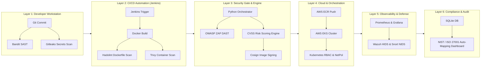

# SentinelOps - Architecture & Project Guide Documentation (Detail)

The `Detail/` directory holds official PDF reference documents, enterprise architecture diagrams, and comprehensive project guides for the SentinelOps DevSecOps Automated Security Pipeline.

---

## 📁 Directory Content Overview

| Document Name | Description | Key Topics |
| :--- | :--- | :--- |
| `DevSecOps_Project_Guide.pdf` | **Official Master Project Blueprint** | Full 12-week roadmap, team role splits, syllabus mapping, interview talking points, and phase-by-phase implementation plans. |
| `DevSecOps Automated Security Pipeline — Architecture.pdf` | **Visual System Architecture** | Enterprise 6-Layer DevSecOps flow: Dev -> CI/CD -> Security Gate -> K8s Cloud -> Observability -> Compliance. |

---

## 🏗️ 6-Layer Security Architecture Flowchart

---

## 📖 Usage Instructions

These PDF files serve as reference material for project evaluation, technical audits, team alignment, and DevSecOps interview preparation.
