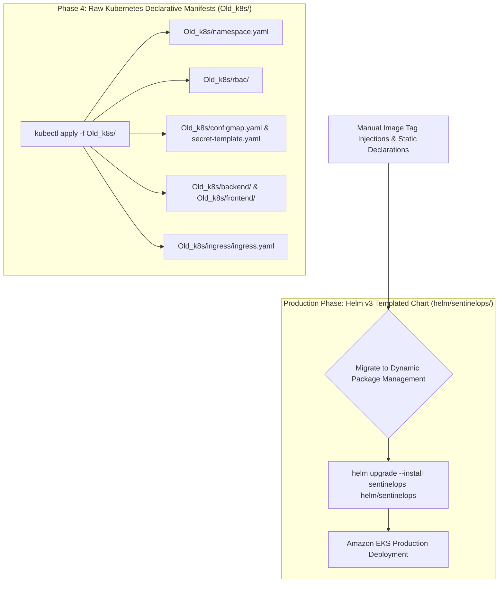

# SentinelOps - Legacy Kubernetes Declarative Manifests (`Old_k8s/`)

The `Old_k8s/` outer directory contains the baseline, raw Kubernetes (`kubectl`) YAML manifests used during Phase 4 of the project before migrating to dynamic Helm v3 templated charts (`helm/sentinelops/`).

---

## 📁 Outer Directory Structure & Subfolder Breakdown

```text
Old_k8s/
├── configmap.yaml                  # Non-sensitive environment variables (PORT, NODE_ENV)
├── namespace.yaml                  # Isolated Kubernetes namespace declaration (sentinelops)
├── secret-template.yaml            # Base64 encoded secret template (MONGO_URL, JWT_SECRET)
├── backend/                        # Backend Kubernetes Workloads
│   ├── deployment.yaml             # Express API deployment spec (replicas, probes, resources)
│   └── service.yaml                # ClusterIP service exposing backend on port 5000
├── frontend/                       # Frontend Kubernetes Workloads
│   ├── deployment.yaml             # React/Nginx deployment spec (replicas, probes, resources)
│   └── service.yaml                # ClusterIP service exposing frontend web app on port 80
├── ingress/                        # Network Ingress Controller Rules
│   └── ingress.yaml                # Nginx Ingress routing for api.sentinelops.local & app.sentinelops.local
├── monitoring/                     # Legacy Prometheus & Grafana manifests
└── rbac/                           # Kubernetes Role-Based Access Control
    └── rbac.yaml                   # ServiceAccounts, Roles, and RoleBindings enforcing least privilege
```

---

## 🔄 Legacy Kubernetes Deployment & Migration Flowchart



---

## 💻 Subfolder Details

1. **`Old_k8s/backend`**: Declarative Deployment and Service YAML files for running Node.js Express API pods in Kubernetes.
2. **`Old_k8s/frontend`**: Declarative Deployment and Service YAML files for running React/Nginx frontend pods in Kubernetes.
3. **`Old_k8s/ingress`**: Ingress resource configuring Nginx Ingress Controller path-based and host-based routing rules.
4. **`Old_k8s/rbac`**: Defines dedicated `ServiceAccount` objects for workloads with strict `Role` and `RoleBinding` permissions.
