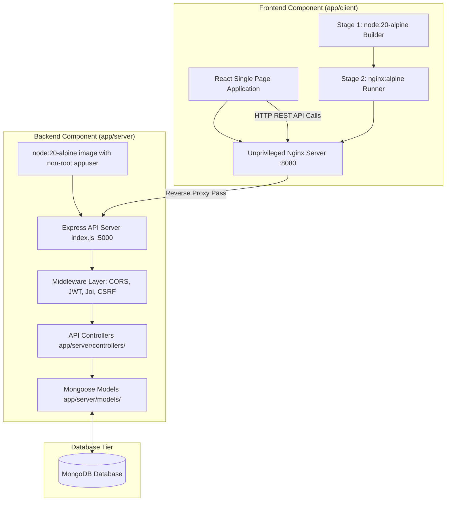

# SentinelOps - Application Microservices Tier (`app/`)

The `app/` outer directory contains the entire full-stack MERN (MongoDB, Express, React, Node.js) microservices application powering SentinelOps. It is divided into two primary subdirectories: `app/client` (React Web Frontend) and `app/server` (Express API Backend).

---

## 📁 Outer Folder Structure & Component Breakdown

```text
app/
├── client/                         # React Frontend Web Application (SPA)
│   ├── build/                      # Production compiled static React assets
│   ├── nginx/                      # Custom Nginx reverse proxy configuration (nginx.conf)
│   ├── public/                     # Static assets (index.html, favicon, manifest.json)
│   ├── src/                        # React source code
│   │   ├── assets/                 # Branding images and icons
│   │   ├── components/             # UI components (auth, bot, navbar, ui)
│   │   ├── pages/                  # Route views (Dashboard, Login, Register, Profile)
│   │   ├── style/                  # Global CSS styles
│   │   └── utils/                  # API fetchers & state helpers
│   ├── Dockerfile                  # Hardened Multi-Stage Dockerfile (Node -> Nginx)
│   └── package.json                # Frontend NPM dependencies
└── server/                         # Node.js Express REST API Microservice
    ├── controllers/                # Request handlers (Auth, User, Home, Pages)
    ├── middleware/                 # Express middleware (JWT, Error Handler, CSRF, Rate Limit)
    ├── models/                     # Mongoose schemas & data models (User, Token, Session)
    ├── routes/                     # API route declarations (/api/v1/auth, /health)
    ├── utils/                      # Helper modules (Database connection, Logger, Mailer)
    ├── index.js                    # Server entry point & Express port listener
    ├── Dockerfile                  # Hardened single-stage Alpine image with non-root user
    ├── eslint.config.mjs          # ESLint code quality rules
    └── package.json                # Backend NPM dependencies
```

---

## 🔄 Full Application Architecture & Data Flowchart



---

## 💻 Subfolder Details

### 1. `app/client` (Frontend Microservice)
- **Technology Stack:** React.js, CSS Modules, Nginx Alpine.
- **Containerization Strategy:** Uses a 2-stage Docker build to discard Node.js build dependencies and serve static assets securely via an unprivileged Nginx process listening on port `8080`.
- **Security Controls:** Non-root execution (`appuser:appgroup`), dropped Linux capabilities, and automated container health check (`HEALTHCHECK`).

### 2. `app/server` (Backend Microservice)
- **Technology Stack:** Node.js 20, Express.js, Mongoose, JWT, Bcrypt, Joi.
- **API Responsibilities:** User authentication, password encryption, JWT session validation, health probe monitoring (`/health`), and database CRUD operations.
- **Containerization Strategy:** Single-stage Alpine image (`node:20-alpine`) running under a dedicated non-root user (`USER appuser`) listening on port `5000`.

---

## 🚀 Execution Commands

```bash
# Spin up both client and server containers via Docker Compose
docker compose up -d --build

# Run backend locally
cd app/server && npm install && npm run dev

# Run frontend locally
cd app/client && npm install && npm start
```
