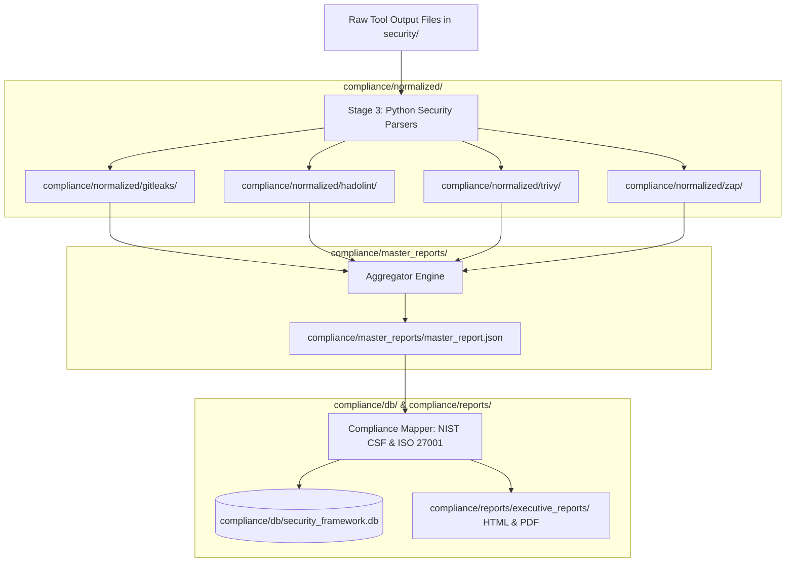

# SentinelOps - Compliance, Risk Scoring & Audit Evidence Tier (`compliance/`)

The `compliance/` outer directory serves as the centralized storage engine for normalized scan outputs, risk scoring metrics, master security reports, NIST CSF / ISO 27001 control mappings, Cosign digital signatures, and SQLite audit databases.

---

## 📁 Outer Directory Structure & Subfolder Breakdown

```text
compliance/
├── db/                             # SQLite / PostgreSQL database storage engine
│   └── security_framework.db       # Database storing scan runs, findings, and compliance verdicts
├── evidence/                       # Cryptographic evidence & Cosign signature payload artifacts
├── logs/                           # Execution logs
│   └── parser.log                  # Central log file for Python parsers & security gate execution
├── master_reports/                 # Consolidated security report artifacts
│   └── master_report.json          # Master aggregated JSON report combining all scanner tools
├── normalized/                     # Schema-validated JSON scan reports per tool
│   ├── gitleaks/                   # Normalized secrets detection JSON (gitleaks_report.json)
│   ├── hadolint/                   # Normalized Dockerfile linting JSON (hadolint_report.json)
│   ├── trivy/                      # Normalized container CVE JSON (trivy_report.json)
│   └── zap/                        # Normalized DAST vulnerability JSON (zap_report.json)
└── reports/                        # Stakeholder security deliverables
    ├── compliance/                 # NIST CSF & ISO 27001 Annex A compliance summaries
    ├── executive_reports/          # Executive HTML & PDF dashboards for management
    ├── gitleaks/                   # Raw & rendered Gitleaks reports
    ├── hadolint/                   # Raw & rendered Hadolint reports
    ├── signing/                    # Cosign image signature verification logs
    ├── trivy/                      # Raw & rendered Trivy reports
    └── zap/                        # Raw & rendered OWASP ZAP reports
```

---

## 🔄 Compliance Data Processing Flowchart



---

## 💻 Subfolder Details

1. **`compliance/normalized`**: Contains normalized JSON output files generated by parsers. Every tool output conforms to a unified Pydantic/dataclass schema (`rule_id`, `tool_name`, `severity`, `cvss_score`, `location`, `description`).
2. **`compliance/master_reports`**: Holds `master_report.json`, which combines all scan results into a single file for Security Gate evaluation.
3. **`compliance/db`**: Houses `security_framework.db`, tracking historical scan runs (`scan_runs` table), vulnerability findings (`vulnerabilities` table), and compliance mappings (`compliance_mappings` table).
4. **`compliance/reports`**: Stores human-readable HTML/PDF reports, executive summaries, and Cosign digital signing verification logs.
