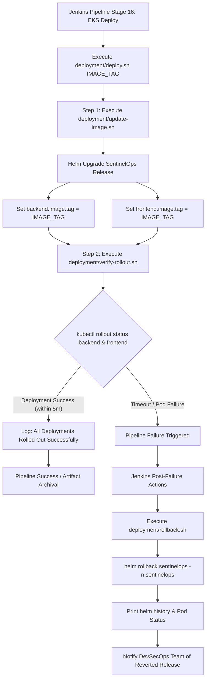

# SentinelOps - Kubernetes Deployment & Rollback Automation

The `deployment/` directory contains shell scripts that automate continuous deployment, status verification, and automated rollback strategies for SentinelOps running on Amazon EKS using Helm v3.

---

## 📁 Directory Structure & Script Overview

| Script Name | Purpose | Key Responsibilities |
| :--- | :--- | :--- |
| `deploy.sh` | **Master Deployment Runner** | Entry point called by Jenkins Stage 16. Executes `update-image.sh` followed by `verify-rollout.sh`. |
| `update-image.sh` | **Helm Release Upgrader** | Runs `helm upgrade --install` against `helm/sentinelops`, dynamically passing image tags for backend and frontend. |
| `verify-rollout.sh` | **Kubernetes Health Checker** | Monitors `kubectl rollout status` for both backend and frontend deployments in the `sentinelops` namespace (5m timeout). |
| `rollback.sh` | **Automated Rollback Engine** | Triggered in Jenkins `post { failure }` block. Reverts Helm release to the previous healthy revision using `helm rollback`. |

---

## 🔄 Deployment & Rollback Lifecycle Flowchart



---

## 🚀 Execution Commands

### Manual Deployment
```bash
# Deploy a specific build tag to Amazon EKS
bash deployment/deploy.sh build-105
```

### Manual Rollback
```bash
# Revert to previous healthy Helm deployment revision
bash deployment/rollback.sh
```

---

## 🔒 Security & Reliability Guarantee
- **Zero-Downtime Rolling Updates:** Kubernetes deployments use rolling update strategies to prevent service disruption during image upgrades.
- **Fail-Safe Self-Healing:** If newly pushed container images crash or fail readiness probes, the pipeline automatically aborts and triggers `rollback.sh` to keep the production cluster healthy.
