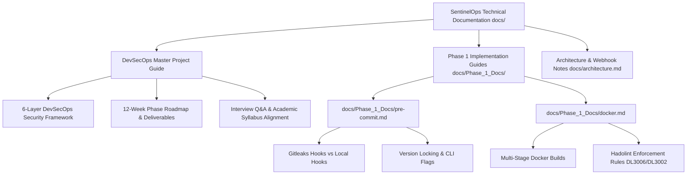

# SentinelOps - Technical Documentation & Developer Guides (`docs/`)

The `docs/` outer directory contains architectural specifications, syllabus mappings, step-by-step implementation roadmaps, pre-commit configuration breakdowns, and container security standards for SentinelOps.

---

## 📁 Outer Directory Structure & Subfolder Breakdown

```text
docs/
├── architecture.md                 # High-level architecture notes & webhook integration specs
├── DevSecOps_Project_Guide.md     # Comprehensive 400+ line master project guide & syllabus mapping
└── Phase_1_Docs/                   # Phase 1 Developer Setup & Tooling Tutorials
    ├── docker.md                   # Multi-stage Docker build guidelines & Hadolint linting rules
    └── pre-commit.md               # Line-by-line breakdown of .pre-commit-config.yaml & hooks
```

---

## 🔄 Technical Documentation Flowchart



---

## 💻 Subfolder Details (`docs/Phase_1_Docs/`)

1. **`pre-commit.md`**: Explains pre-commit hooks line by line. Teaches developers how external git repositories (Gitleaks) differ from local script hooks (njsscan/Bandit), version locking with `rev:`, and pass-filename CLI options.
2. **`docker.md`**: Standardizes container image creation across the team. Defines rules for multi-stage Docker builds, non-root user creation (`appuser`), and Hadolint linter compliance.
