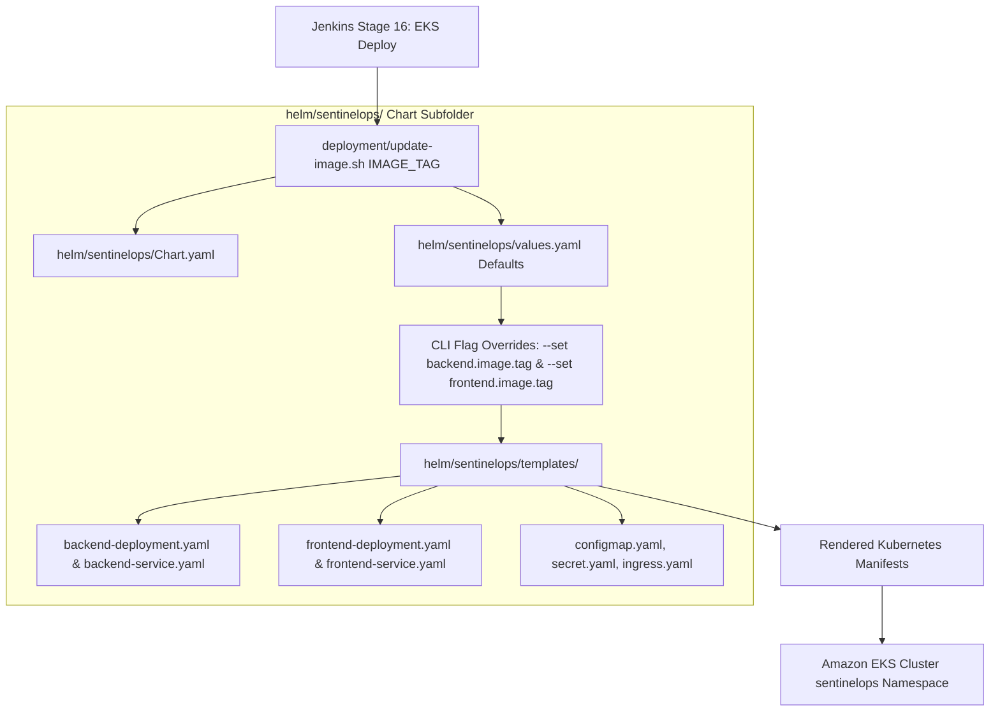

# SentinelOps - Helm v3 Kubernetes Package Management (`helm/`)

The `helm/` outer directory contains the production-grade Helm v3 chart (`sentinelops`) used by the Jenkins CI/CD pipeline to deploy, parameterize, upgrade, and manage the release lifecycle of SentinelOps on Amazon EKS.

---

## 📁 Outer Directory Structure & Subfolder Breakdown

```text
helm/
└── sentinelops/                    # Master Helm Chart Directory
    ├── Chart.yaml                  # Chart metadata (apiVersion: v2, chart version, appVersion)
    ├── values.yaml                 # Deployment values & container image repository defaults
    ├── .helmignore                 # File patterns ignored during Helm packaging
    ├── charts/                     # Sub-chart dependencies directory
    └── templates/                  # Kubernetes Yaml Template Manifests
        ├── backend-deployment.yaml # Express API deployment template (probes, securityContext)
        ├── backend-service.yaml    # ClusterIP service template for backend API
        ├── configmap.yaml          # Environment configuration template
        ├── frontend-deployment.yaml# React/Nginx web app deployment template
        ├── frontend-service.yaml   # ClusterIP service template for frontend UI
        ├── ingress.yaml            # Nginx Ingress routing template
        └── secret.yaml             # Encrypted secret injection template
```

---

## 🔄 Helm Chart Packaging & Deployment Flowchart



---

## 💻 Subfolder Details (`helm/sentinelops/`)

1. **`helm/sentinelops/values.yaml`**: Holds default values for ECR repositories, ports, replica counts, resource requests/limits, and ingress rules.
2. **`helm/sentinelops/templates/`**: Contains Go-template parametrized Kubernetes manifests that dynamically inject environment variables and build tags at deploy time.
