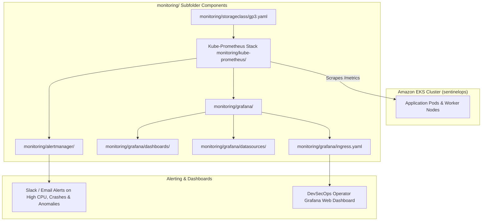

# SentinelOps - Observability, Monitoring & Security Metrics (`monitoring/`)

The `monitoring/` outer directory contains configuration specs, Helm values, Grafana dashboards, Alertmanager notification rules, and Kubernetes storage classes for Layer 5 (Observe & Respond) of SentinelOps.

---

## 📁 Outer Directory Structure & Subfolder Breakdown

```text
monitoring/
├── alertmanager/                   # Alertmanager notification routing & severity grouping rules
├── grafana/                        # Visual Monitoring Dashboards & Datasources
│   ├── dashboards/                 # Custom JSON dashboards (Cluster Health, Pod Restarts, Security Gate)
│   ├── datasources/                # Prometheus & Loki datasource connection configs
│   └── ingress.yaml                # Ingress routing spec exposing Grafana UI to operators
├── kube-prometheus/                # Kube-Prometheus-Stack Helm Chart Configuration
│   └── values.yaml                 # Node exporter, kube-state-metrics & scrape interval parameters
└── storageclass/                   # Kubernetes Dynamic Storage Provisioner Specs
    └── gp3.yaml                    # AWS EBS CSI Driver GP3 StorageClass definition
```

---

## 🔄 Observability & Alerting Data Flowchart



---

## 💻 Subfolder Details

1. **`monitoring/grafana`**: Custom Grafana dashboards (`dashboards/`), Prometheus datasources (`datasources/`), and Ingress rules (`ingress.yaml`) to visualize cluster health and security metrics.
2. **`monitoring/kube-prometheus`**: Overrides `values.yaml` for deploying `kube-prometheus-stack` via Helm, tuning node-exporter and scrape intervals.
3. **`monitoring/alertmanager`**: Configures alert severity grouping and notification channels.
4. **`monitoring/storageclass`**: Defines the AWS EBS CSI `gp3` storage class (`gp3.yaml`) providing persistent volumes for Prometheus TSDB storage.
