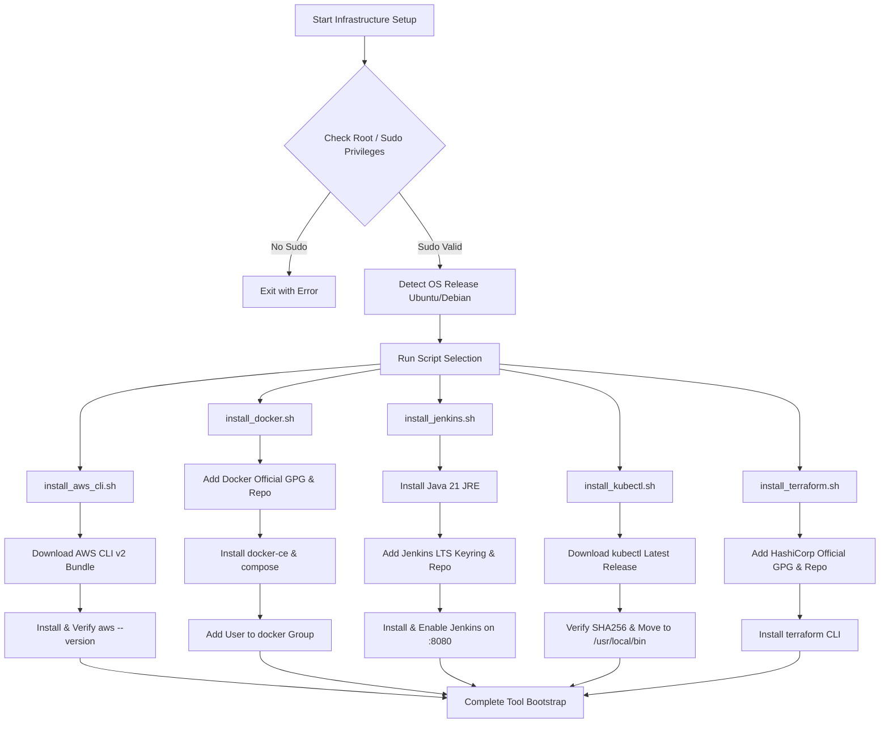

# SentinelOps - Infrastructure Setup & Tool Automation Scripts

The `scripts/` directory contains automated Shell (`.sh`) scripts designed to install and configure all baseline prerequisites and dependencies required to build, test, deploy, and monitor the SentinelOps DevSecOps ecosystem on Debian/Ubuntu Linux hosts.

---

## 📁 Directory Structure & Script Overview

| Script Name | Target Tool | Key Installed Packages & Responsibilities |
| :--- | :--- | :--- |
| `install_aws_cli.sh` | **AWS CLI v2** | Unzips and installs AWS CLI v2 binary, verifies `aws --version`, configures shell completion. |
| `install_docker.sh` | **Docker Engine & Docker Compose** | Installs Docker CE, `containerd.io`, `docker-compose-plugin`, adds current user to `docker` group, enables systemd daemon. |
| `install_jenkins.sh` | **Jenkins LTS** | Configures APT keyring, installs OpenJDK 21 JRE, installs Jenkins LTS, enables service on port `8080`, retrieves initial admin password. |
| `install_kubectl.sh` | **Kubernetes CLI (`kubectl`)** | Downloads stable `kubectl` binary, verifies checksum, installs to `/usr/local/bin/kubectl`, sets executable permissions. |
| `install_terraform.sh` | **HashiCorp Terraform** | Adds HashiCorp GPG key & APT repo, installs `terraform` CLI, verifies installation and versioning. |

---

## 🔄 Installation Workflow & Lifecycle

The scripts are idempotent and include OS pre-checks (Ubuntu/Debian), privilege validation (`sudo`), and error handling (`set -euo pipefail`).



---

## 🚀 Execution Instructions

Run any of the scripts directly from the repository root:

```bash
# 1. Install Docker Engine & Docker Compose
bash scripts/install_docker.sh

# 2. Install Jenkins Automation Server
bash scripts/install_jenkins.sh

# 3. Install AWS CLI v2
bash scripts/install_aws_cli.sh

# 4. Install Kubernetes CLI (kubectl)
bash scripts/install_kubectl.sh

# 5. Install HashiCorp Terraform
bash scripts/install_terraform.sh
```

> **Note:** Log out and log back in after running `install_docker.sh` so your user account inherits non-root Docker execution permissions (`usermod -aG docker $USER`).
