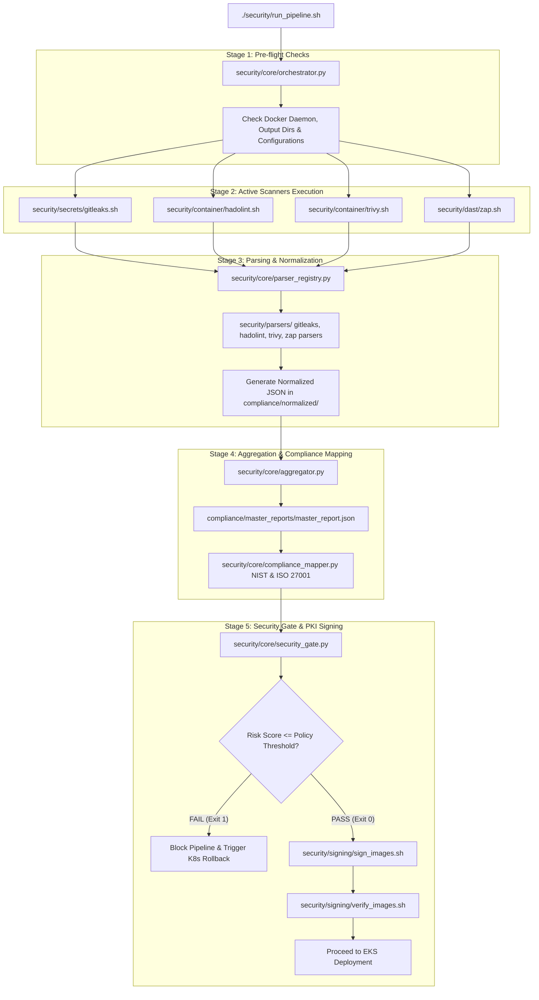

# SentinelOps - Security Automation & Orchestration Engine (`security/`)

The `security/` outer directory houses the entire automated DevSecOps security engine for SentinelOps. It contains all scanner execution wrappers, Python parsers, risk scoring engines, compliance mappers, security gates, database managers, and Cosign PKI image signing scripts.

---

## 📁 Outer Directory Structure & Subfolder Breakdown

```text
security/
├── run_pipeline.sh                 # Master bash wrapper executing orchestrator intents
├── common/                         # Python shared utilities (Severity, Status, Logger, Metadata)
├── config/                         # Security policy rules (policy.yaml), parser configs & keys
├── container/                      # Hadolint & Trivy execution scripts (hadolint.sh, trivy.sh)
├── core/                           # Primary Python Security Orchestrator & Risk Engine
│   ├── aggregator.py               # Aggregates normalized reports into master_report.json
│   ├── base_parser.py              # Abstract base class for all security tool parsers
│   ├── compliance_mapper.py        # Maps findings to NIST CSF & ISO 27001 controls
│   ├── exceptions.py               # Custom pipeline exception definitions
│   ├── orchestrator.py             # Master 5-Stage Orchestrator controller
│   ├── parser_registry.py          # Auto-registration plugin registry for parsers
│   ├── report_generator.py         # Renders executive HTML & PDF reports
│   ├── report_reader.py/writer.py  # Standardized report read/write handlers
│   ├── risk_engine.py              # CVSS-weighted composite risk calculator
│   ├── security_gate.py            # Evaluates composite risk score against thresholds
│   └── statistics.py               # Generates summary vulnerability metrics
├── dast/                           # OWASP ZAP execution script (zap.sh)
├── db/                             # SQLite/PostgreSQL database connector (database.py, query_db.py)
├── knowledge/                      # Rule mappings (trivy_rules.json, hadolint_rules.json, gitleaks_rules.json)
├── parsers/                        # Parser implementations (gitleaks_parser.py, trivy_parser.py, etc.)
├── policies/                       # Security policy configuration files (security-policy.conf)
├── sast/                           # Static Application Security Testing scripts
├── schemas/                        # Dataclasses & Pydantic schemas (report.py, finding.py, summary.py)
├── scripts/                        # Internal bash helpers (docker.sh, logger.sh, report.sh)
├── secrets/                        # Gitleaks execution script (gitleaks.sh)
└── signing/                        # Cosign PKI keypair generation, image signing & verification
    ├── generate_keys.sh            # Generates cosign.key / cosign.pub keypair
    ├── sign_images.sh              # Signs backend & frontend images post-gate
    └── verify_images.sh            # Verifies digital signatures before EKS deploy
```

---

## 🔄 Master Security Pipeline Execution Flowchart



---

## 💻 Detailed Subfolder Explanations

1. **`security/core`**: The central brain of the framework. `orchestrator.py` manages the 5 execution stages. `risk_engine.py` calculates CVSS-weighted risk scores (`CRITICAL=10`, `HIGH=5`, `MEDIUM=2`, `LOW=0.5`). `security_gate.py` asserts pass/fail logic against `security/config/policy.yaml`.
2. **`security/parsers`**: Contains python parsers that ingest raw tool output and convert findings into uniform JSON schemas.
3. **`security/signing`**: Manages Sigstore **Cosign** PKI keypair generation, digital image signing post-security-gate pass, and public key verification prior to cluster deployment.
4. **`security/secrets`, `container`, `dast`**: Contains wrapper shell scripts (`gitleaks.sh`, `hadolint.sh`, `trivy.sh`, `zap.sh`) that execute scanner tools inside Docker containers.
5. **`security/common`, `schemas`, `config`, `knowledge`**: Python schemas, shared loggers, severity definitions, rule sets, and threshold configuration files.

---

## 🚀 Execution CLI Intent Options

```bash
# Pre-build scanner execution (Gitleaks & Hadolint)
./security/run_pipeline.sh pre-build

# Post-build container scan (Trivy)
./security/run_pipeline.sh post-build

# DAST web application scan (OWASP ZAP)
./security/run_pipeline.sh dast

# Report generation & compliance mapping
./security/run_pipeline.sh report

# Security Gate evaluation
./security/run_pipeline.sh gate --soft-fail

# Cosign Digital Image Signing & Verification
./security/run_pipeline.sh sign
./security/run_pipeline.sh verify
```
