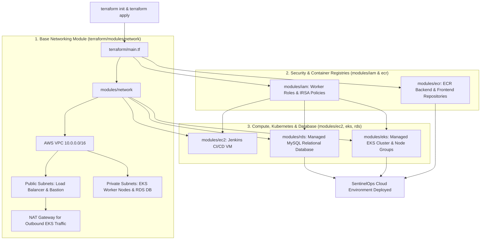

# SentinelOps - Infrastructure as Code with Terraform (`terraform/`)

The `terraform/` outer directory provisions the complete AWS cloud infrastructure for SentinelOps using declarative HashiCorp Terraform configuration files and modular AWS resource templates.

---

## 📁 Outer Directory Structure & Subfolder Breakdown

```text
terraform/
├── main.tf                         # Master root configuration instantiating all infrastructure submodules
├── variables.tf                    # Input variable declarations (AWS region, CIDR ranges, node counts)
├── outputs.tf                      # Output exports (EKS cluster name/endpoint, ECR URLs, RDS endpoint)
├── provider.tf                     # AWS provider version requirements and region configuration
├── versions.tf                     # Minimum Terraform binary version constraint (>= 1.5.0)
├── data.tf                         # External data lookups (AWS Availability Zones, AMIs)
├── terraform.tfvars                # Environment parameter values (credentials git-ignored)
└── modules/                        # Reusable AWS component infrastructure submodules
    ├── ec2/                        # Provisions Jenkins CI/CD master server VM on Ubuntu 22.04 LTS
    ├── ecr/                        # Elastic Container Registries (sentinelops-backend, sentinelops-frontend)
    ├── eks/                        # Managed EKS Control Plane, OIDC provider, and Managed Node Groups
    ├── iam/                        # IAM roles, policies, and IRSA OIDC service account bindings
    ├── network/                    # VPC, Public/Private Subnets, IGW, NAT Gateway, Route Tables
    └── rds/                        # Subnet Groups, Security Groups, and Managed MySQL DB Instance
```

---

## 🔄 Cloud Provisioning Architecture & Dependency Flowchart



---

## 💻 Submodule Details (`terraform/modules/`)

1. **`modules/network`**: Provisions isolated VPC architecture across 2 Availability Zones, 2 Public Subnets, 2 Private Subnets, Internet Gateway, and NAT Gateway.
2. **`modules/eks`**: Deploys managed EKS cluster with Kubernetes version 1.29+, OIDC provider integration, and auto-scaling managed node groups running in private subnets.
3. **`modules/ecr`**: Provisions Docker image repositories with image immutability options and **Scan-on-Push** enabled for CVE scanning.
4. **`modules/iam`**: Implements **IAM Roles for Service Accounts (IRSA)** so EKS pods authenticate via AWS OIDC tokens without static hardcoded keys.
5. **`modules/ec2`**: Deploys a dedicated EC2 instance for running the Jenkins automation server with security group ingress rules restricting port `8080`.
6. **`modules/rds`**: Provisions a multi-AZ ready MySQL instance for storing vulnerability scan histories, risk scores, and compliance reports.

---

## 🚀 Execution Instructions

```bash
# 1. Initialize Terraform modules and AWS provider plugins
cd terraform
terraform init

# 2. Preview infrastructure changes
terraform plan

# 3. Apply infrastructure creation on AWS
terraform apply -auto-approve
```
